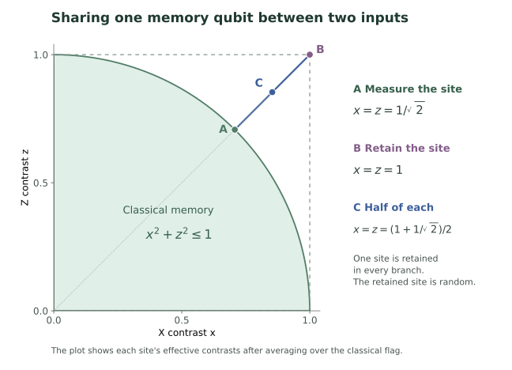

# Quantum Interface Cost

### How much must remain quantum when the measurement is chosen later?

An encoder receives one unknown quantum register. It must store the
register before learning which local X or Z measurement will be requested.
Classical records are free; only the quantum memory is limited.

The central question is **when retaining original qubits is optimal, and
when a collective encoding helps**. The supplied results give exact
common-accuracy costs through four inputs, a complete allocation rule for
one memory qubit at every input size, and a collective advantage for a
specified unequal-accuracy task.

**Manuscript writing is on hold.** Potential collaborators are welcome
to contact **Ruge Lin** at [gogoko699@gmail.com](mailto:gogoko699@gmail.com).

## Start with one review

The teaching anchor is Gühne, Haapasalo, Kraft, Pellonpää and Uola,
[*Incompatible measurements in quantum information science*](https://arxiv.org/abs/2112.06784),
*Reviews of Modern Physics* **95**, 011003 (2023).
The [learning path](docs/LEARNING_PATH.md) selects the relevant sections
and connects them to this project. It is the only external tutorial
required by the path; the additional arguments are explained here.

## Read the repository in three passes

| Pass | Route | Purpose |
|---|---|---|
| The question | This page, then the [learning path](docs/LEARNING_PATH.md) and [first tutorial](docs/tutorial/MEASUREMENTS_TO_MEMORY.md) | Understand the memory task and work the two-input example |
| The proof | [Memory to proofs](docs/tutorial/PROOF_BRIDGE.md), then the [core argument](docs/CORE_ARGUMENT.md) | Connect an arbitrary encoder to the exact memory bounds |
| The evidence | [Scientific scope](docs/SCIENTIFIC_SCOPE.md), [prior comparison](docs/CORE_PRIOR_COMPARISON.md) and [evidence freeze](docs/SCIENTIFIC_EVIDENCE_FREEZE.md) | Check assumptions, attribution and proof evidence |

## A first example: two inputs, one memory qubit

With only classical memory, a single qubit can support later noisy X and
Z measurements with contrasts $x,z$ precisely when $x^2+z^2\le1$.
Equal contrasts therefore stop at $1/\sqrt2$.

For two inputs, keep one qubit chosen by a fair coin and measure the
other with the compatible X/Z measurement. Record the choice and the
measurement outcome. Each site is retained half the time, so all four
possible queries have contrast

```math
\begin{aligned}
\eta&=\frac{1+1/\sqrt2}{2}\approx0.8536,\\
\varepsilon&=\frac{1-\eta}{2}\approx0.0732.
\end{aligned}
```

Here $\varepsilon$ is the worst-case binary total-variation error, over
all input states. The one-qubit theorem proves that an arbitrary collective
encoder cannot improve this common accuracy.

<p align="center">
  
</p>

**Reading the figure.** A is the compatible classical boundary; B is
perfect retention. Their midpoint C is the contrast at each site when
exactly one of two input qubits is retained, chosen with equal probability.

The [worked tutorial](docs/tutorial/MEASUREMENTS_TO_MEMORY.md) derives the
disk, constructs this protocol and then treats unequal accuracies.

## The operational model

| When | What happens |
|---|---|
| Before the query | An arbitrary collective encoder acts on one unknown $n$-qubit state, which may be entangled across its sites |
| What survives | A quantum register of dimension at most $2^q$ in every branch, plus an unrestricted finite classical record |
| After the query | A site $i$ and either $X_i$ or $Z_i$ are specified; a decoder using the memory and record returns one binary outcome |

The guarantee holds for every input and each allowed query. The quantum
cap is branchwise, not an average. All branches are accepted; there are no
extra copies, source reaccess, preshared entanglement or free quantum bypass.
The decoder may depend on the query. Its task is to reproduce the requested
measurement statistics, not to reconstruct the whole input state.

## Main results and their boundaries

### Exact finite common accuracy

Retaining a random subset of $q$ sites and measuring the rest gives the
unrestricted optimum for $1\le n\le4$ and integer $q=0,\ldots,n$:

```math
\boxed{\eta_{\max}(n,q)
=\frac qn+\left(1-\frac qn\right)\frac1{\sqrt2}.}
```

The converse covers arbitrary collective encoders, spectra and binary
decoders. These are all 14 integer-qubit budgets through four inputs.
The same formula holds for $q=1$ at every $n$.

### Complete one-qubit allocation

For arbitrary local contrasts $(x_i,z_i)\in[0,1]^2$, the exact region
with one memory qubit is

```math
\boxed{\sum_i w(x_i,z_i)\le1,}
```

where

```math
w(x,z)=\left[x+z-1-\sqrt{2(1-x)(1-z)}\right]_+.
```

Here $[a]_+=\max(a,0)$. The tutorial explains $w$ as a required retention
fraction. The converse applies established CHSH monogamy; every feasible
profile has a random original-site-retention implementation.

### A collective advantage for unequal accuracies

A complete encoder for 31 inputs using five memory qubits has

```math
x_i=1,\qquad z_i=\frac1{\sqrt{31}}\quad\text{at every site}.
```

It exceeds the
[defined original-site-retention class](docs/CORE_ARGUMENT.md#4-a-collective-advantage-with-five-memory-qubits),
including joint measurements of discarded sites. This is a class
separation, not a claim of unrestricted optimality or improved common
accuracy.

The [balanced-spectrum theorem and stability](docs/CORE_ARGUMENT.md#5-a-separate-all-size-structural-companion)
are optional structural companions. The general common-accuracy optimum,
sharp entropy bound and asymptotic rate remain open. The smallest remaining
finite common-accuracy case is $(n,q)=(5,2)$.

## Proofs, sources and evidence

The [core argument](docs/CORE_ARGUMENT.md) connects the selected proofs.
The [focused source map](docs/CORE_PRIOR_COMPARISON.md) distinguishes
established frameworks and ingredients from the supplied evaluations.
Proof reconstructions are internal; no external peer-review or exhaustive
publication-priority certification is claimed.

The [scientific evidence freeze](docs/SCIENTIFIC_EVIDENCE_FREEZE.md) pins
the reviewed proof inputs, checker sources and historical reports.

## Reproduce the exact certificate

The essential quarter-rank scalar certificate uses Python's standard
library only. From the repository root, reproduce it into a temporary file:

```bash
python -E tools/check_nonflat_quarter_rank_certificate.py --output /tmp/qic-nonflat-quarter-rank-certificate.json
```

That certificate proves two polynomial positivity statements used by the
analytical proof. The [reproducibility record](docs/REPRODUCIBILITY.md)
explains its role and the different scope of the archive's matrix diagnostics.
Use ordinary Python without `-O`; `-E` ignores environment settings that
could disable the checker's assertions.
The tutorial figure is an illustration; its optional generator
[`tools/plot_learning_geometry.py`](tools/plot_learning_geometry.py)
requires Matplotlib.

## Research record and license

The [research index](docs/RESEARCH_INDEX.md) preserves access to the wider
archive. The [research note](RESEARCH_NOTE.md) and [status ledger](docs/STATUS.md)
record assumptions and accumulated claim status. Contributors should read
[AGENTS.md](AGENTS.md).

Research owner: Ruge Lin. [MIT license](LICENSE), copyright (c) 2026 Ruge Lin.
